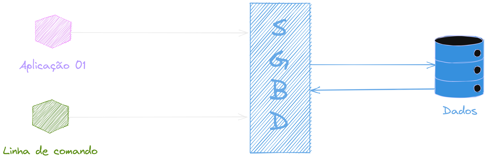
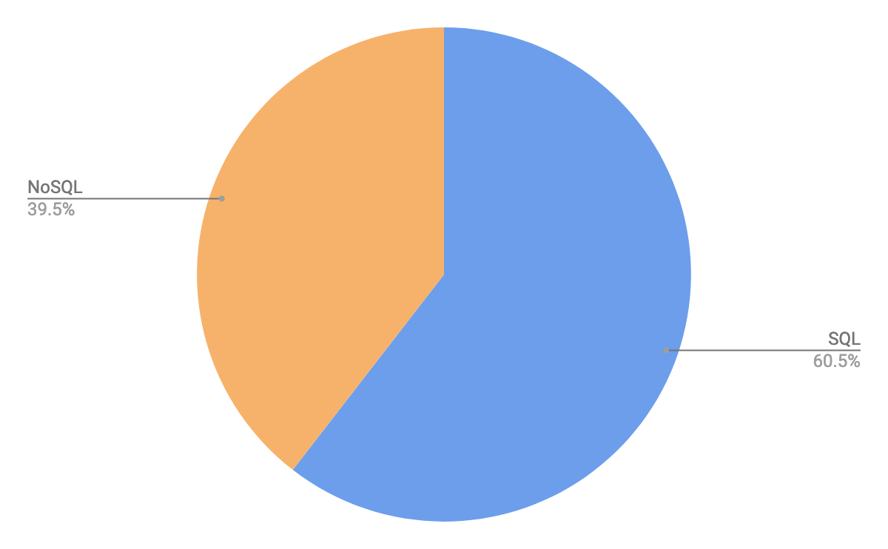
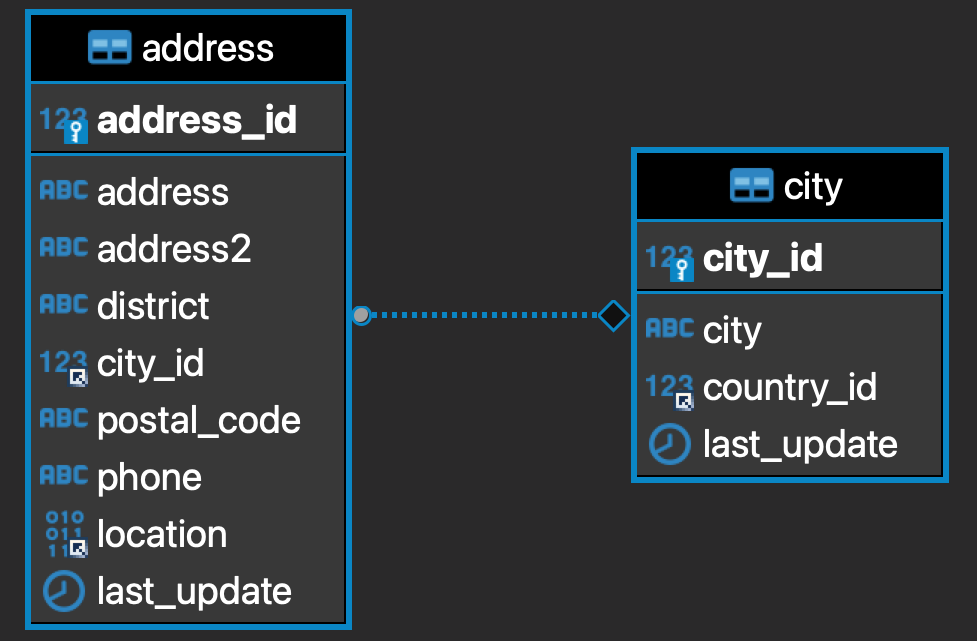

# Banco de dados

---

## Foco de hoje

- O que é um banco
- Tipos de bancos de dados
- SQL
- Tabelas
- ...

---

### O que é um dado?

---

### O que é um dado?

{ width=50% }

---

### Papel do "banco de dados"

- Organizar os dados
- Armazenar
- Cuidar da segurança
- Cuidar de falhas
- ...

---

## SGBD

(Sistema de gerenciamento de banco de dados)

---

### SGBD

---

### Tipos de bancos

---

### Tipos de bancos

{ width=90% }

---

### Mais usados

https://db-engines.com/en/ranking

---

### Dúvidas?

{ width=90% }

---

{ width=70% }

Structured Query Language, ou Linguagem de Consulta Estruturada

---

### Principais comandos

- INSERT
- SELECT
- UPDATE
- DELETE

---

### CRUD

{ width=70% }

---

### Constraints(restrições)

- NOT NULL
- DEFAULT
- UNIQUE
- PRIMARY KEY
- FOREIGN KEY

---

### Chaves

{ width=70% }

---

### Momento Spoiler
